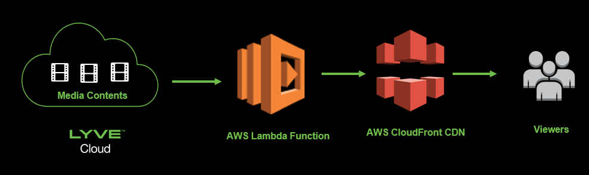
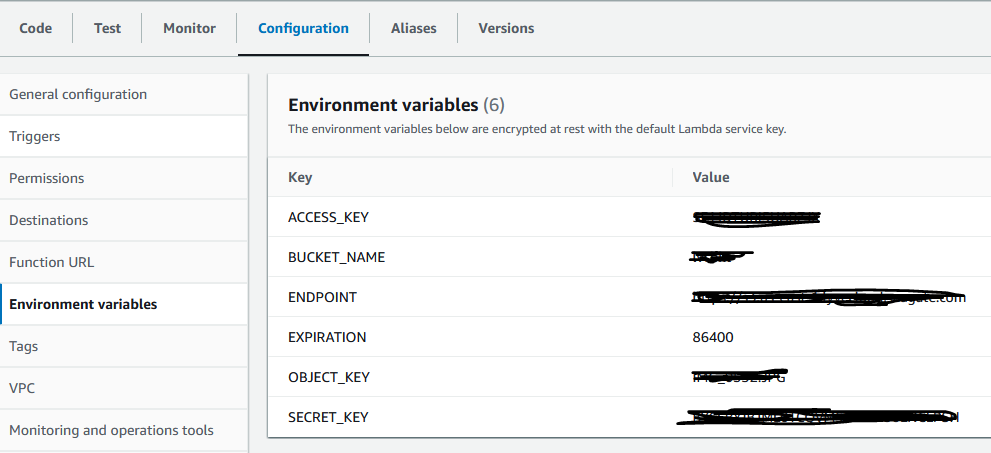
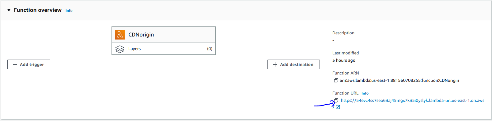
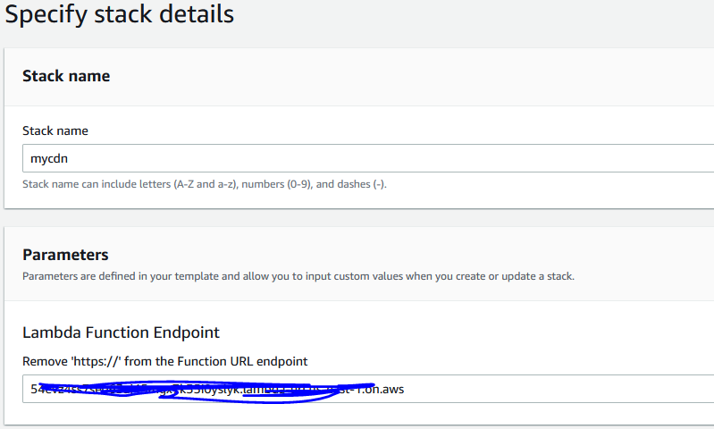
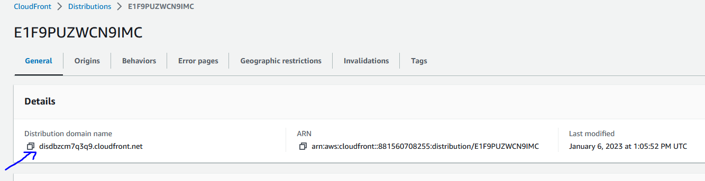
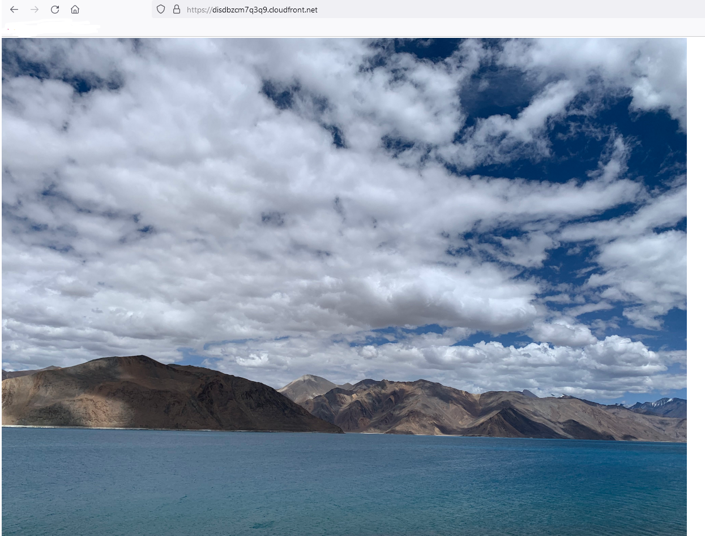

# Access Lyve S3 Media contents through Amazon CloudFront

## Introduction
Using Amazon CloudFront with AWS Lambda as origin access the media contents from Lyve Cloud S3.

Fronting Lyve Cloud S3 Media contents with Lambda and CloudFront allows you to cache content closer to the viewer by leveraging the globally distributed content distribution network. You could define custom domain names, turn on HTTPS delivery over TLS. Further, you could activate AWS Web Application Firewall (WAF) and AWS Shield Advanced to protect your application from malicious bots, prevent common application exploits and enhance protection from DDoS attacks.
Amazon CloudFront is content delivery network (CDN) service and Lyve Cloud S3 Object Storage accelerates content delivery and improves the overall security posture of your mission critical applications. When a user requests for content through CloudFront, the request is routed to the edge location that provides the lowest latency and is delivered with optimal performance.

## How It Works
Seagate Lyve Cloud S3 is private bucket and CloudFront requires public access to the content in order to distribute it to end users.
To use CloudFront with private content in Lyve S3 service, need to implement some mechanism to provide temporary access to the content for CloudFront.
AWS Lambda will allow users to run the code and that code will fetch the Media Contents from Lyve S3 and pass it to AWS CloudFront distribution.

## Architecture 
The sequence diagram below shows how the high level data flow looks like.
<p style="text-align:left"></p>

 
## Requirements
* Lyve Cloud
  * Access Key
  * Secret Key
  * S3 API Endpoint
  * Name of the bucket that contains files to browse
* AWS Account
  * IAM
  * Lambda
  * CloudFront
  * CloudFormation

## Setup Walkthrough 
 - Create a new bucket using https://help.lyvecloud.seagate.com/en/managing-buckets.html
   pay attention that you place the bucket in the region you want it to be in.

 - Create the permission that have full access to the bucket that has been created.
   Using the permission create the Service Account and note down the credentials.
   Refer help document https://help.lyvecloud.seagate.com/en/managing-service-accounts.html

 - Let's create IAM Role for AWS Service execution.
   - Login to AWS Console and navigate to IAM Role.
     - Create Role, select trusted entity 'aws services' and select use case 'Lambda', give the name to Role.
     - Next page select policy 'AWSLambdaBasicExecutionRole', create a role.

 - Create Lambda Function and Obtain the Function URL.
   - Go to the AWS Lambda console in the AWS Region you want to deploy the function.
   - Create a Python based Lambda Function.
   - Provide the Function name and select the current Python runtime.  
   - Change the execution role to the role that we have created on previous step.
   - Under ‘Advanced settings’, check the ‘Enable function URL’ field. Since the Lambda function needs to be publicly accessible select ‘NONE’ for Auth type. This also create the necessary resource based policies to allow public access to the function.
   - Click ‘Creation function’ to finish the function creation setup.
   - Navigate to 'Environmental variable' Tab on left panel and add Environmental Variables and its respective values.
     <p style="text-align:left"></p>
   - Open the Lambda function.
   - Copy and Paste the contents of [LyveS3PresignedURL.py](code/LyveS3PresignedURL.py) into the Code source section.
   - Note down the Lambda Function URL as shown in below figure.
     <p style="text-align:left"></p>

 - Next, create the Amazon CloudFront configuration.
   - Navigate to CloudFormation and select Create Stack.
   - opt for the option 'Template Ready' and Upload the template file  [CFT_Cloudfront.yml](code/CFT_Cloudfront.yml)
   - Enter the Function URL obtained earlier into the ‘Parameters’ section ‘Lambda Function Endpoint’ field as shown in below screenshot
     <p style="text-align:left"></p>
     Remove https:// and trailing slash from the Function URL while providing the input.
   - Once the CloudFormation template is deployed, navigate to the ‘Outputs’ tab of the CloudFormation stack to access the default CloudFront domain name created. You should see the media file that you stored in Lyve S3 in response when accessed it through browser.
    <p style="text-align:left"></p>
     

## Results 
 - Hit the CloudFront URL your local browser and you will see the media file that stored in Lyve S3.
<p style="text-align:left"></p>


## Tested by
* Jan 6, 2023: Rahul Gode (rahul.gode@seagate.com)
* month day, year: full_name (email) on your_environment

## **Note:** All files should be uploaded (all the files you used for the integration solution) under one folder, including the README.md file. 
### Project Structure

This section will describe the representation of each of the folders or files in the structure.
```
.
├── README.md
├── code
│   └── css
        lyves3browser.css
│   └── js
        lyves3browser.js
        libs
└── images
    └── cloudfront.PNG
        cloudfront_url.PNG
        result.PNG
        data_flow.PNG
        lambda_url.PNG
        variables.PNG
```

### `/code`
This folder contains all the code files.

### `/images`
This folder contains all the images.
