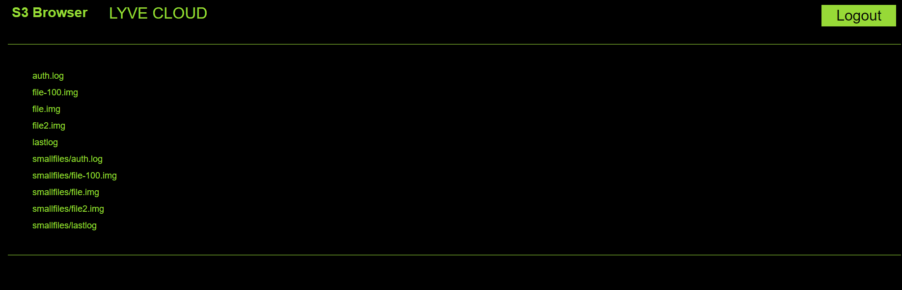

# Lyve-S3-Browser

## Introduction
Lyve-S3-Browser is a file browser for Lyve Cloud S3.

Lyve-S3-Browser is simply a browser-based client
Enabling Lyve Cloud users to browse,download and upload files over Lyve Cloud S3 bucket.


## Requirements
* Lyve Cloud
  * Access Key
  * Secret Key
  * S3 API Endpoint
  * Name of the bucket that contains files to browse
* Ubuntu or Linux compute instance
  * Apache installed
  * Port 80 open
  * Root or sudo access

## Known Limitations 
Currently file upload functionality is not working as CORS is not enabled and will be fixed in next release.

## Running Steps
 - Create a new bucket using https://help.lyvecloud.seagate.com/en/managing-buckets.html
   pay attention that you place the bucket in the region you want it to be in.

 - Create the permission that have full access to the bucket that has been created.
   Using the permission create the Service Account and note down the credentials.
   Refer help document https://help.lyvecloud.seagate.com/en/managing-service-accounts.html

 - Download the code from Git Hub and store under /var/www/html directory.
   Restart the apache service 'service apache2 restart', make sure port 80 is open.

 - Customize the s3 endpoint at the end of the index.html file. It is set to us-east Region
   endpoint by default. See https://help.lyvecloud.seagate.com/en/s3-api-endpoint.html#s3 region
   for a listing of proper endpoints.


## Results 
 - Hit the IP of the server where website is hosted or URL if DNS is configured on your local browser and you will land on console page.
<p style="text-align:left"></p>

 - Write the bucket name and add Access Key ID and Secret Access Key ID and click on Login button.
<p style="text-align:left"></p>

 - Brower will show the files stored on Lyve Cloud Bucket.
<p style="text-align:left"></p>

 - You can select any perticular file and download it.


## Tested by
* Sept 29, 2022: Rahul Gode (rahul.gode@seagate.com) on Ubuntu
* month day, year: full_name (email) on your_environment

## **Note:** All files should be uploaded (all the files you used for the integration solution) under one folder, including the README.md file. 
### Project Structure

This section will describe the representation of each of the folders or files in the structure.
```
.
├── README.md
├── index.html
├── code
│   └── css
        lyves3browser.css
│   └── js
        lyves3browser.js
        libs
└── images
    └── Landing_page.PNG
        bucket_details.PNG
        Browsing_files.PNG
```

### `/code`
This folder contains all the code files.

### `/images`
This folder contains all the images.
